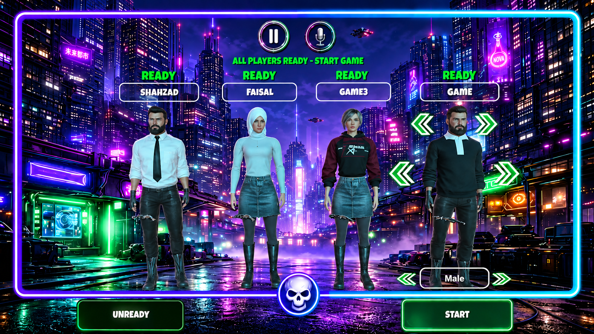
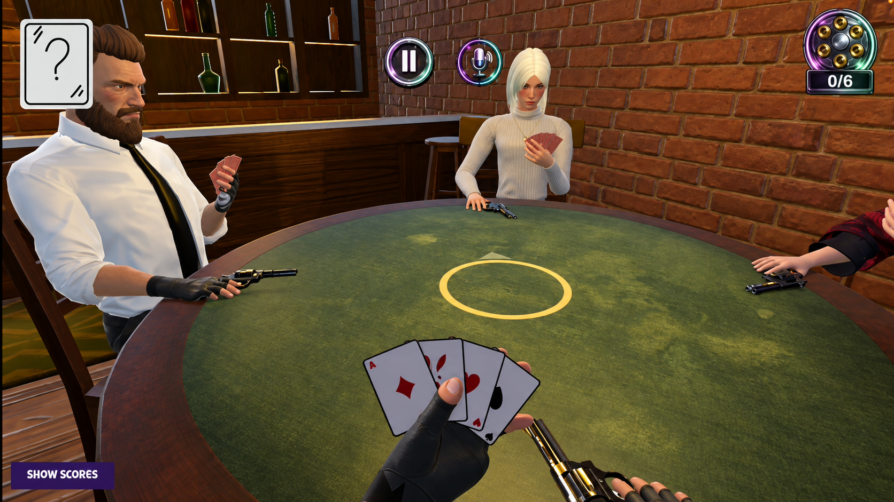
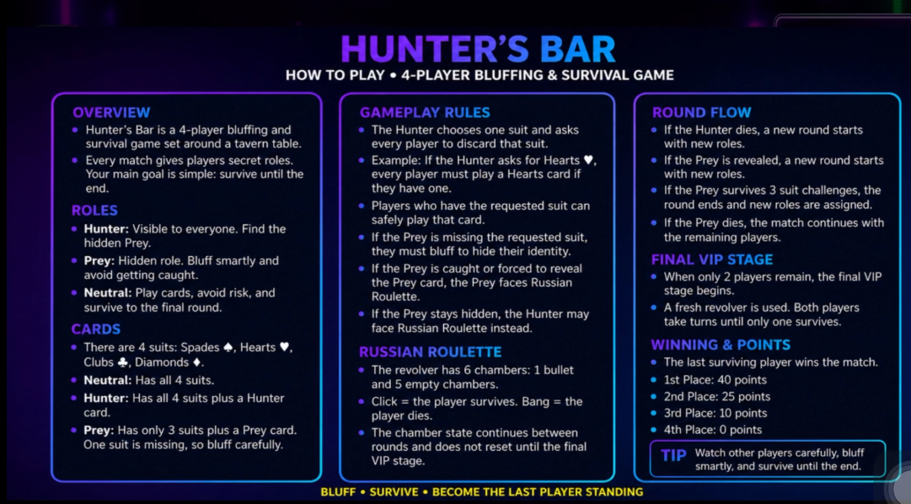
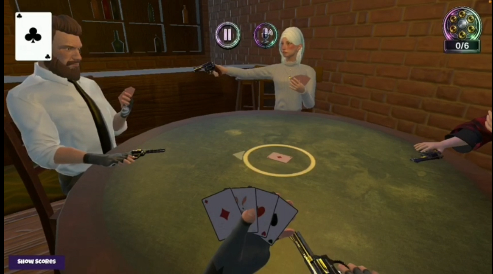
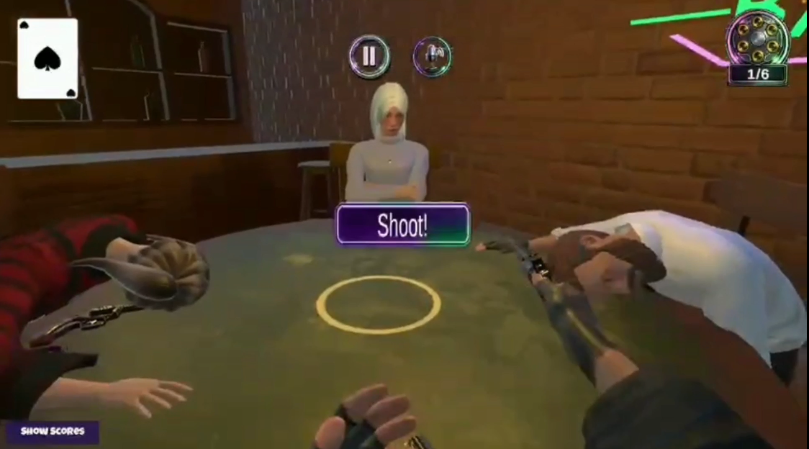

# Hunter's Bar

### Multiplayer Mobile Card Game

**iOS • Android • Unity • C# • Multiplayer**

A competitive multiplayer card-game experience developed for mobile platforms.

 

---

## About Hunter's Bar

**Hunter's Bar** is a multiplayer mobile card game designed around player roles, strategy, bluffing and competitive decision-making.

The game brings multiple players together in real-time matches and combines traditional card-game mechanics with unique role-based gameplay.

It was developed for both **iOS and Android** with a focus on multiplayer stability, mobile usability and polished game flow.

---

## Platforms

---

## Core Features

### Multiplayer Gameplay

Real-time multiplayer game flow designed for multiple connected players.

### Role-Based Gameplay

Players receive different roles with different objectives, creating strategy, bluffing and social decision-making.

### Card Game Systems

- Card distribution
- Player turns
- Card interactions
- Match progression
- Round management
- Win and elimination logic

### Multiplayer Lobby

- Player joining
- Ready system
- Player seating
- Match start handling
- Multiplayer session flow

### Mobile UI

Designed and implemented for mobile devices with support for different screen sizes and interaction patterns.

### Cross-Platform Development

Built for:

- iPhone / iPad
- Android phones and tablets

---

## Development Areas

Cipher Coders worked across several areas of the project:

- Multiplayer gameplay systems
- Game-state synchronization
- Turn management
- Lobby and player management
- Card-game logic
- Match flow
- Player elimination and results
- Mobile UI implementation
- Localization support
- iOS and Android deployment
- Debugging and gameplay stabilization

---

## Project Gallery

### Lobby & Match Setup

  

The multiplayer lobby allows players to join, prepare, select their character setup and begin the match flow together.

---

### Core Gameplay

  

Hunter's Bar is built around a shared table experience where players manage cards, roles, bluffing and risk-based decisions in real time.

---

### Rules & Game Flow

  

The game includes clear gameplay rules and round flow to support multiplayer decision-making, bluffing mechanics and survival progression.

---

### Survival / Shoot Moment

  

A signature part of the experience is the survival tension created by the shooting / elimination phase, which increases match intensity and player pressure.

---

### In-Match Action

  

The game combines card play, hidden roles, player observation and strategic decisions to create a competitive multiplayer experience on mobile.

---
## Technology

`Unity` • `C#` • `Multiplayer` • `iOS` • `Android` • `Mobile UI`

---

## Development Focus

**Multiplayer Engineering • Mobile Game Development • Gameplay Systems • UI • Cross-Platform Deployment**

---

## Need a Multiplayer Mobile Game?

Cipher Coders develops multiplayer games, mobile games and interactive applications for iOS, Android and other platforms.

### Let's Build Your Game

